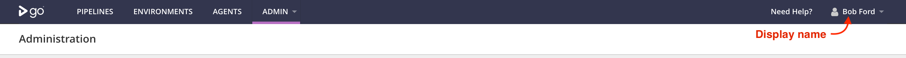

# Authorization Configuration

The `Authorization Configuration` is used to configure a connection to an LDAP/AD server. The configuration is later used by the plugin to authorize a user or search for them in the LDAP/AD server. You can also configure multiple LDAP/AD servers by creating multiple authorization configurations.

1. Login to the GoCD server as an administrator and navigate to **_Admin_** _>_ **_Security_** _>_ **_Authorization Configuration_**. <br/>
2. Click on **_Add_** to create a new authorization configuration. <br/>
3. Provide a unique identifier for this authorization configuration and select `LDAP Authorization Plugin for GoCD` as the **Plugin**.

4. **URI (`Mandatory`):** Specify your ldap server URL.

    

    ```xml
    <property>
      <key>Url</key>
      <value>ldap://ldap-server-url:10389</value>
    </property>
    ```

5. **StartTLS (`Optional`):** StartTLS is a mechanism for avoiding the need to listen on a separate port for SSL connections. Enabling StartTLS would require the root certificate of the CA that issued your LDAP/AD server certificate to be configured (see below).

    

    ```xml
    <property>
       <key>StartTLS</key>
       <value>false</value>
    </property>
    ```

6. **ManagerDN (`Optional`):**  The LDAP/AD manager user's DN, used to connect to the LDAP/AD server.

    

    ```xml
    <property>
       <key>ManagerDN</key>
       <value>uid=admin,ou=system,dc=example,dc=com</value>
    </property>
    ```

7. **Password (Mandatory if `ManagerDN` provided):** The LDAP/AD manager password, used to connect to the LDAP/AD server. Required only if a ManagerDN is specified.
8. **Certificate (`Optional`):**  Provide the root **_X.509 Certificate_** in **_PEM_** format of the CA that issued your LDAP/AD server certificate if using `ldaps` or `StartTLS` is enabled. You can use [keytool](https://docs.oracle.com/javase/8/docs/technotes/tools/unix/keytool.html) or [openssl](https://www.openssl.org/docs/man1.1.1/man1/x509.html) to generate x.509 certificate in `PEM` format. If a certificate is not configured, the plugin will look for the certificate in following order -
    1. Truststore defined using Java system property `javax.net.ssl.trustStore`.
    2. If not defined, then `${JAVA_HOME}/lib/security/jssecacerts` or `${JAVA_HOME}/lib/security/cacerts`.

    > LDAP/AD X.509 Certificate in PEM format

    

    ```xml
    <property>
       <key>Certificate</key>
       <value>
          -----BEGIN CERTIFICATE-----
          MIIDBzCCAe+...1E2mRQFQHn64AhA=
          -----END CERTIFICATE-----
       </value>
    </property>
    ```

9. **SearchBases (`Mandatory`):** This field defines the location in the directory from which the LDAP search begins.
You can provide multiple search bases each separated by newlines. If multiple search bases are configured the plugin looks for the user in each search base sequentially until the user is found.

    > Single search base

    

    ```xml
    <property>
       <key>SearchBases</key>
       <value>ou=users,ou=system</value>
    </property>
    ```

    > Multiple search base

    

    ```xml
    <property>
       <key>SearchBases</key>
       <value>
        ou=users,ou=system
        ou=employee,ou=system
        </value>
    </property>
    ```

10. **UserLoginFilter (`Mandatory`):** It is an LDAP search filter used during authentication to lookup for a user entry matching the given expression.
    - In following example, the `{0}` is replaced with the username provided by the user at the login screen. For a user with username `bford`, the below filter resolves to `(sAMAccountName=bford)`.<br/><br/>

    > In the following example the filter searches for a username matching the `sAMAccountName` attribute.

    

    ```xml
    <property>
       <key>UserLoginFilter</key>
       <value>(sAMAccountName={0})</value>
    </property>
    ```

11. **UserNameAttribute (`Mandatory`):** The value of this attribute will be used by GoCD as a `username` of the logged in user. The GoCD uses `username` to decide role based permissions for an logged in user.

    In the following example the UserLoginFilter uses an Or filter whereby the User can login using either of `sAMAccountName`, `mail` or `uid`.
    On successful authentication the plugin would return a [User](https://plugin-api.gocd.org/current/authorization/#authenticate-user) object to GoCD with the `username` derived from the UserNameAttribute which is `sAMAccountName` in this example.

    

    ```xml
    <property>
       <key>UserLoginFilter</key>
       <value>(|(sAMAccountName={0})(mail={0})(uid={0}))</value>
    </property>
    <property>
       <key>UserNameAttribute</key>
       <value>sAMAccountName</value>
    </property>
    ```

12. **UserSearchFilter (`Optional`):** It is an LDAP search filter used to lookup users matching a given search term. This allows GoCD administrators to search for LDAP/AD users from [User Summary Page](https://docs.gocd.org/current/configuration/managing_users.html) in GoCD. Default filter used is `(|(sAMAccountName=*{0}*)(uid=*{0}*)(cn=*{0}*)(mail=*{0}*)(otherMailbox=*{0}*))`.

    

    ```xml
    <property>
       <key>UserSearchFilter</key>
       <value>(|(sAMAccountName=*{0}*)(uid=*{0}*))</value>
    </property>
    ```

13. **DisplayNameAttribute (`Optional`):** The value of this attribute in the logged in user's record in the LDAP server is used as a display name. Default attribute used is `cn`.

    

    ```xml
    <property>
       <key>DisplayNameAttribute</key>
       <value>displayName</value>
    </property>
    ```

     <table>
       <tr>
         <td>
           <span class="description">
             Display name is shown in the top right corner after logging in
           </span>
           <figure class="img-full-width">
             
           </figure>
         </td>
       </tr>
     </table>
     <br/>
 
14. **EmailAttribute (`Optional`):** Value of this attribute is mapped to GoCD user's `mail` field. Default value used is `mail`. Once the attribute is mapped, users can create custom email notification as described [here](https://docs.gocd.org/current/configuration/dev_notifications.html).

    

    ```xml
    <property>
       <key>EmailAttribute</key>
       <value>mail</value>
    </property>
    ```

15. **SearchTimeout (`Optional`):** Timeout in seconds for search operations, default value is **_5 seconds_**.

    

    ```xml
    <property>
      <key>SearchTimeout</key>
      <value>10</value>
    </property>
    ```
16. Click on **_Check connection_** to verify your configuration. The plugin will establish a connection with LDAP/AD server using the configuration and will return the verification status.

17. Once check connection succeeds, click on **_Save_** to save the authorization configuration.


#### Example authorization configuration


<hr/>

**Alternatively, the configuration can be added directly to the GoCD config XML using the `<authConfig>` tag.  It  should be added under `<security/>` tag as described in the following example:**

```xml
<security>
 <authConfigs>
    <authConfig id="my-ldap" pluginId="com.thoughtworks.gocd.authorization.ldap">
      <property>
        <key>Url</key>
        <value>ldap://ldap-server-url:10389</value>
      </property>
       <property>
        <key>StartTLS</key>
        <value>false</value>
      </property>
      <property>
        <key>ManagerDN</key>
        <value>uid=admin,ou=system,dc=example,dc=com</value>
      </property>
      <property>
        <key>Password</key>
        <value>secret</value>
      </property>
      <property>
        <key>Certificate</key>
        <value>
          -----BEGIN CERTIFICATE-----
          MIIDBzCCAe+...1E2mRQFQHn64AhA=
          -----END CERTIFICATE-----
        </value>
      </property>
      <property>
        <key>SearchBases</key>
        <value>
          ou=Teams,dc=corporate,dc=example,dc=com
          ou=users,ou=system
        </value>
      </property>
      <property>
        <key>UserLoginFilter</key>
        <value>(sAMAccountName={0})</value>
      </property>
      <property>
        <key>UserNameAttribute</key>
        <value>sAMAccountName</value>
      </property>
      <property>
        <key>UserSearchFilter</key>
        <value>(|(sAMAccountName=*{0}*)(uid=*{0}*))</value>
      </property>
      <property>
        <key>DisplayNameAttribute</key>
        <value>displayName</value>
      </property>
      <property>
        <key>EmailAttribute</key>
        <value>mail</value>
      </property>
      <property>
        <key>SearchTimeout</key>
        <value>10</value>
      </property>
    </authConfig>
  </authConfigs>
</security>
```

* **_Note:_** You can also configure multiple LDAP/AD servers or multiple LDAP configurations within one server by adding multiple `<authConfig/>` elements.

    ```xml
    <authConfigs>
      <authConfig id="first_ldap_server" pluginId="com.thoughtworks.gocd.authorization.ldap">
        ...
      </authConfig>
      <authConfig id="second-ldap_server" pluginId="com.thoughtworks.gocd.authorization.ldap">
        ...
      </authConfig>
    </authConfigs>
    ```
