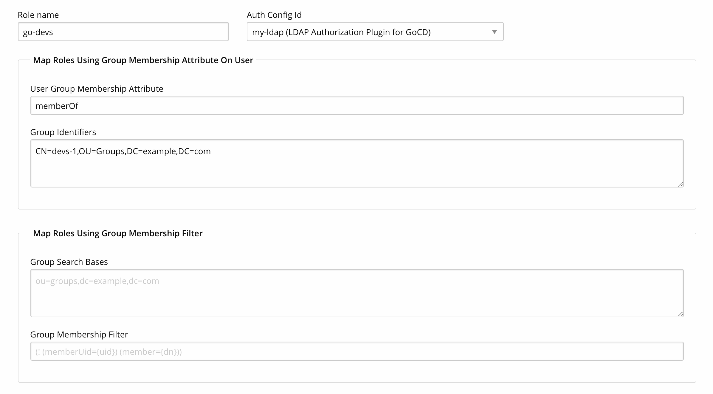
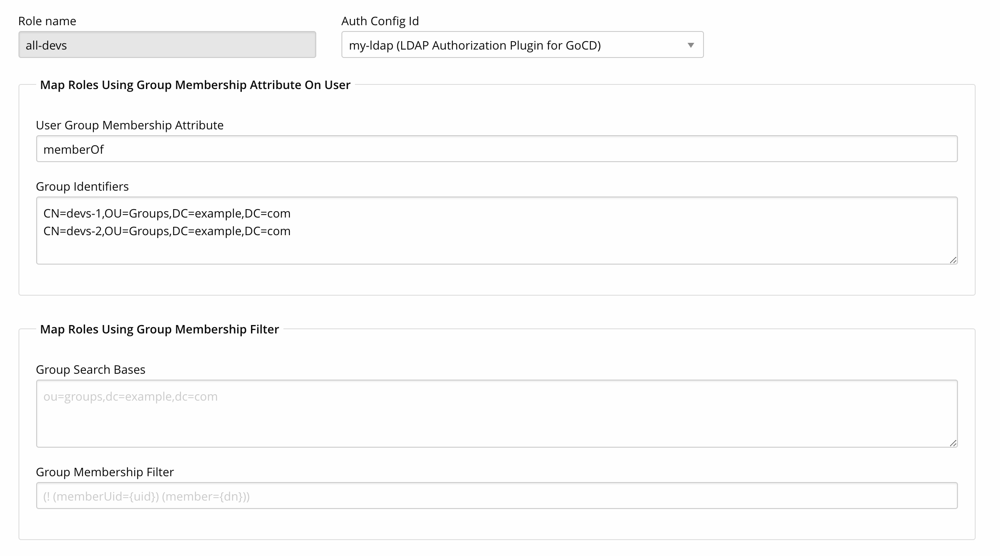
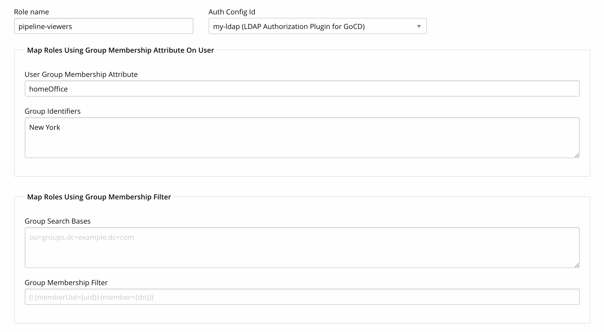
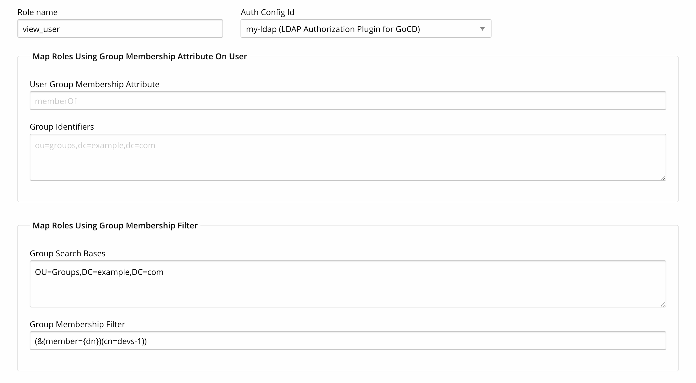
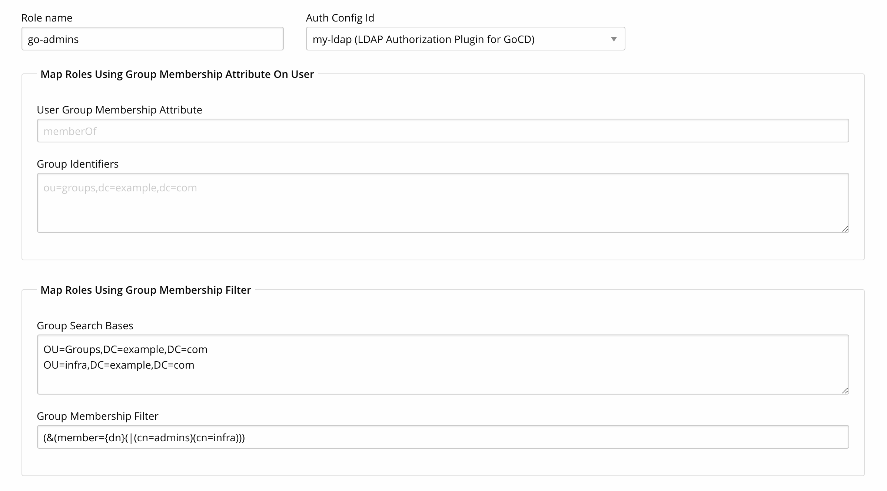
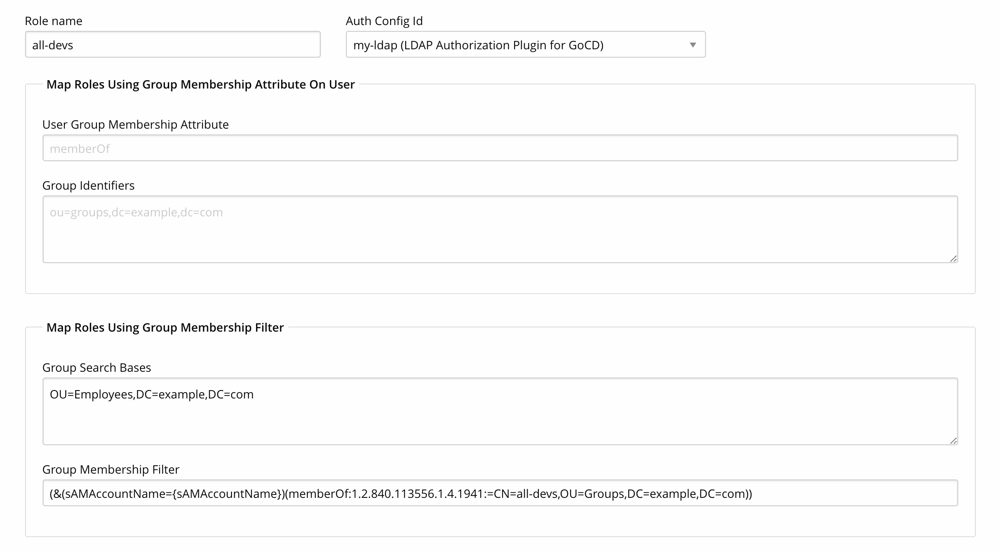
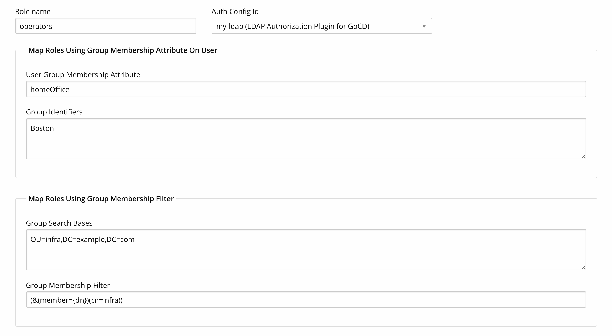

# Plugin Role Configuration Examples

The test data used for the examples in this page are as follows:

### User data

|  cn              | sAMAccountName     | distinguishedName                               | memberOf                               | homeOffice |
|------------------|--------------------|-------------------------------------------------|----------------------------------------|------------|
|  Bob Ford        | bford              | CN=Bob Ford,OU=Employees,DC=example,DC=com      | CN=admins,OU=Groups,DC=example,DC=com  | New York   |
|  Alice Poirot    | apoirot            | CN=Alice Poirot,OU=Employees,DC=example,DC=com  | CN=devs-1,OU=Groups,DC=example,DC=com  | Chicago    |
|  Sarah Banks     | sbanks             | CN=Sarah Banks,OU=Employees,DC=example,DC=com   | CN=devs-2,OU=Groups,DC=example,DC=com  | New York   |
|  Phillip Banks   | pbanks             | CN=Phillip Banks,OU=Employees,DC=example,DC=com | CN=devs-1,OU=Groups,DC=example,DC=com  | Boston     |
|  Service Account | svc_acc            | CN=Service Account,OU=infra,DC=example,DC=com   | CN=infra,OU=infra,DC=example,DC=com    |            |

### Group data

|  cn              | distinguishedName                               | member                                                                                                  |
|------------------|-------------------------------------------------|---------------------------------------------------------------------------------------------------------|
|  admins          | CN=admins,OU=Groups,DC=example,DC=com           | CN=Bob Ford,OU=Employees,DC=example,DC=com                                                              |
|  all-devs        | CN=all-devs,OU=Groups,DC=example,DC=com         | CN=devs-1,OU=Groups,DC=example,DC=com CN=devs-2,OU=Groups,DC=example,DC=com                         |
|  devs-1          | CN=devs-1,OU=Groups,DC=example,DC=com           | CN=Alice Poirot,OU=Employees,DC=example,DC=com CN=Phillip Banks,OU=Employees,DC=example,DC=com      |
|  devs-2          | CN=devs-2,OU=Groups,DC=example,DC=com           | CN=Sarah Banks,OU=Employees,DC=example,DC=com                                                           |
|  infra           | CN=infra,OU=infra,DC=example,DC=com             | CN=Service Account,OU=infra,DC=example,DC=com                                                           |

# Map users to a role using the UserGroupMembershipAttribute and GroupIdentifiers

<table>
  <tr>
    <td>
      
        <strong id="scenario-1">Scenario 1: </strong>
        Map a role to user using memberOf attribute on user
      
    </td>
  </tr>
  <tr>
    <td>
      
        With the following plugin role configuration, users <strong>Alice Poirot</strong> and <strong>Phillip Banks</strong>
        will get <strong>go-devs</strong> role as both have <strong>memberOf</strong> attribute with value <code>CN=devs-1,OU=Groups,DC=example,DC=com</code>.
      
       
      
    </td>
  </tr>
</table>

---

<table>
  <tr>
    <td>
      
        <strong id="scenario-2">Scenario 2: </strong>
        Map a role to user using memberOf attribute on user with multiple group identifiers
      
    </td>
  </tr>
  <tr>
    <td>
      
        With the following plugin role configuration, users <strong>Alice Poirot</strong>, <strong>Sarah Banks</strong> and <strong>Phillip Banks</strong>
        will get <strong>all-devs</strong> role. Alice Poirot and Phillip Banks are memberOf
        <code>CN=devs-1,OU=Groups,DC=example,DC=com</code> while Sarah Banks is a memberOf <code>CN=devs-2,OU=Groups,DC=example,DC=com</code>
      
       
      
    </td>
  </tr>
</table>

---

<table>
  <tr>
    <td>
      
        <strong id="scenario-3">Scenario 3: </strong>
        Map a role to user using custom attribute on user
      
    </td>
  </tr>
  <tr>
    <td>
      
        With the following plugin role configuration, users <strong>Sarah Banks</strong> and <strong>Bob Ford</strong>
        will get <strong>pipeline-viewers</strong> role since both the user have attibute <strong>homeOffice</strong> with value <code>New York</code>.
      
       
      
    </td>
  </tr>
</table>

# Map users to a role using the GroupMembershipFilter and GroupSearchBases

<table>
  <tr>
    <td>
      
        <strong id="scenario-4">Scenario 4: </strong>
        Map a role to user using group membership filter
      
    </td>
  </tr>
  <tr>
    <td>
      
        With the following plugin role configuration, users <strong>Alice Poirot</strong> and <strong>Phillip Banks</strong>
        will get <strong>view_user</strong> role since both the users are members of <code>CN=devs-1,OU=Groups,DC=example,DC=com</code> group.
      
       
      
    </td>
  </tr>
</table>

---

<table>
  <tr>
    <td>
      
        <strong id="scenario-5">Scenario 5: </strong>
        Map a role to user using groups from different OU
      
    </td>
  </tr>
  <tr>
    <td>
      
        With the following plugin role configuration, users <strong>Bob Ford</strong> and <strong>Service Account</strong>
        will get <strong>go-admins</strong> role since group <code>admins</code> has a member Bob Ford and <code>infra</code> has member Service Account.
         
       
      
    </td>
  </tr>
</table>

---

<table>
  <tr>
    <td>
      
        <strong id="scenario-6">Scenario 6: </strong>
        Map a role to user using nested group membership filter
      
    </td>
  </tr>
  <tr>
    <td>
      
        With the following plugin role configuration, users <strong>Alice Poirot</strong>, <strong>Phillip Banks</strong> and <strong>Sarah Banks</strong>
        will get <strong>all-devs</strong> role since the users are members of one of the child group of <strong>all-devs</strong>.
         
        Here, filter contains a number <strong>:1.2.840.113556.1.4.1941:</strong> which is OID of ldap rule <code>LDAP_MATCHING_RULE_IN_CHAIN</code>. Documentation for <code>LDAP_MATCHING_RULE_IN_CHAIN</code> is available <a href="https://msdn.microsoft.com/en-us/library/aa746475(VS.85).aspx" target="_blank">here</a>.
           
       
      
    </td>
  </tr>
</table>

---

<table>
  <tr>
    <td>
      
        <strong id="scenario-7">Scenario 7: </strong>
        Map a role using group membership attribute or group membership filter
      
    </td>
  </tr>
  <tr>
    <td>
      
        With the following plugin role configuration, plugin will assign a role using group membership attribute first if it fails to do so,
        it will check for group membership filter to assign a role to user. Users <strong>Service Account</strong> and <strong>Phillip Banks</strong>
        will get <strong>Operators</strong> role since the Service Account is member of <code>CN=infra,OU=infra,DC=example,DC=com</code> group and
        Phillip's home office is <code>Boston</code>.
       
       
      
    </td>
  </tr>
</table>
